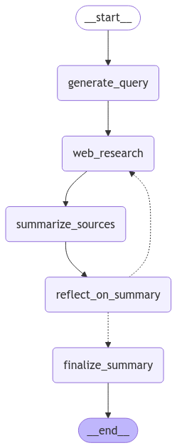

# AI Research Summary Generator

## Overview

The **AI Research Summary Generator** is a modular Python application designed to automate the process of researching, summarizing, and refining information on specific topics using advanced language models. Leveraging tools like LangChain and OpenAI's GPT-4o, this system performs web searches, generates summaries, identifies knowledge gaps, and formulates follow-up queries to ensure comprehensive coverage of the research topic.

## Features

- **Automated Web Research**: Conducts targeted web searches to gather relevant information.
- **Dynamic Summarization**: Generates and extends summaries based on gathered data.
- **Reflective Analysis**: Identifies knowledge gaps and formulates follow-up queries to deepen research.
- **State Management**: Maintains the state of the research process, including gathered sources and summaries.
- **Modular Architecture**: Easily extendable and maintainable codebase with clear separation of concerns.
- **Graph-Based Workflow**: Utilizes a state graph to manage the flow of the research process.

## Table of Contents

- [Features](#features)
- [Architecture](#architecture)
- [Installation](#installation)
- [Configuration](#configuration)
- [Usage](#usage)
- [Modules](#modules)
  - [final_summary.py](#final_summarypy)
  - [reflect.py](#reflectpy)
  - [research_topic.py](#research_topicpy)
  - [summarize_sources.py](#summarizesourcespy)
  - [web_search.py](#web_searchpy)
  - [state.py](#statepy)
  - [main.py](#mainpy)
- [Contributing](#contributing)
- [License](#license)

## Architecture

The application is structured into several Python modules, each responsible for a specific part of the research and summarization process. The workflow is managed using a state graph that routes the process based on the current state and conditions.



## Installation

### Prerequisites

- Python 3.8 or higher
- [pip](https://pip.pypa.io/en/stable/installation/)

### Steps

1. **Clone the Repository**

   ```bash
   git clone https://github.com/rsaketh002/ai-research-summary-generator.git
   cd ai-research-summary-generator
   ```

2. **Create a Virtual Environment**

   ```bash
   python -m venv venv
   source venv/bin/activate  # On Windows use `venv\Scripts\activate`
   ```

3. **Install Dependencies**

   ```bash
   pip install -r requirements.txt
   ```

## Configuration

The application uses environment variables for configuration. Create a `.env` file in the root directory and add the necessary variables.

### Example `.env` File

```env
OPENAI_API_KEY=your_openai_api_key
# Add other necessary environment variables here
```

## Usage

To execute the research and summarization process, run the `main.py` script:

```bash
python main.py
```

This will initiate the workflow based on the predefined research topic and generate a final summary.

## Modules

### final_summary.py

Generates the final summary by consolidating the running summary and sources gathered during the research process.

**Key Functions:**
- `final_summary(state: SummaryState)`: Combines the running summary with all gathered sources to produce the final summary.

### reflect.py

Analyzes the current summary to identify knowledge gaps and formulates follow-up queries to guide further research.

**Key Functions:**
- `reflect_on_summary(state: SummaryState)`: Uses GPT-4 to analyze the summary and generate a follow-up query.

### research_topic.py

Generates targeted web search queries based on the research topic to gather relevant information.

**Key Functions:**
- `research_topic(state: SummaryState)`: Creates a web search query using GPT-4 tailored to the research topic.

### summarize_sources.py

Summarizes the web search results and integrates them into the running summary.

**Key Functions:**
- `summarize_sources(state: SummaryState)`: Generates or extends the summary based on new web research results.

### web_search.py

Performs web searches using the generated queries and retrieves relevant results.

**Key Functions:**
- `web_search(state: SummaryState)`: Executes a web search and updates the state with new sources and results.

### state.py

Defines the data structures used to maintain the state of the research process.

**Key Classes:**
- `SummaryState`: Main state class holding all relevant information.
- `SummaryStateInput`: Input data structure.
- `SummaryStateOutput`: Output data structure.

### main.py

Orchestrates the entire research and summarization workflow using a state graph.

**Key Components:**
- `route_research(state: SummaryState)`: Determines the next step in the workflow based on the current state.
- `StateGraph`: Manages the flow between different modules.
- Execution of the graph to generate the final summary.

## Contributing

Contributions are welcome! Please follow these steps:

1. **Fork the Repository**
2. **Create a Feature Branch**

   ```bash
   git checkout -b feature/YourFeature
   ```

3. **Commit Your Changes**

   ```bash
   git commit -m "Add your message"
   ```

4. **Push to the Branch**

   ```bash
   git push origin feature/YourFeature
   ```

5. **Open a Pull Request**

## License

This project is licensed under the [MIT License](LICENSE).

---

**Note:** Ensure you have the necessary API keys and permissions to use OpenAI's GPT-4o and other integrated services. Handle all credentials securely and do not expose them in public repositories.